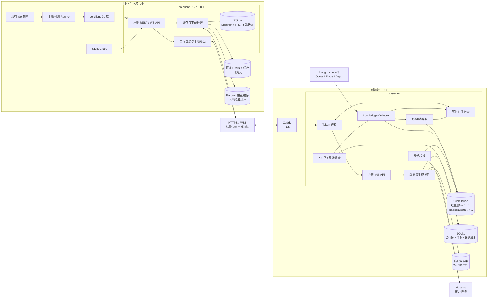
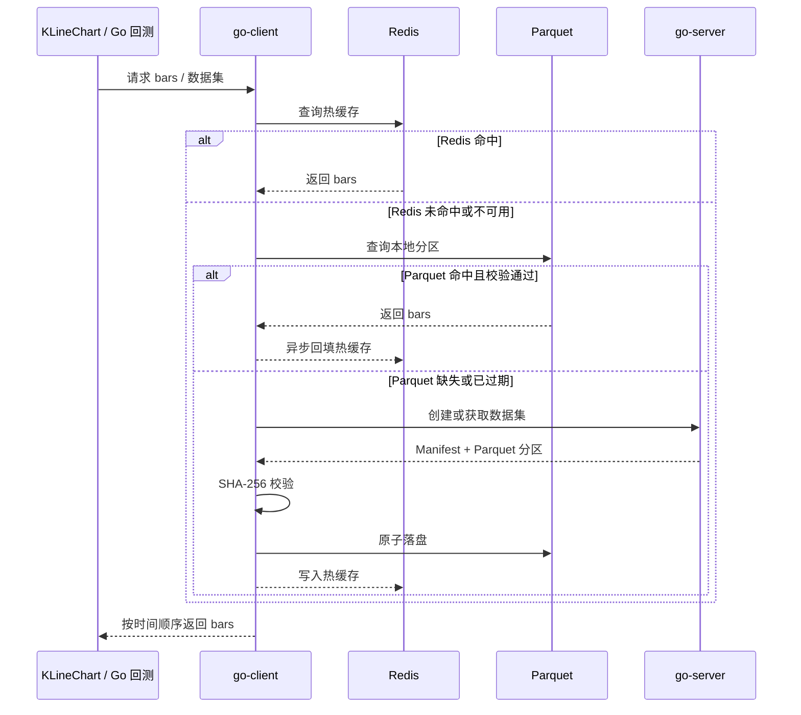

# 日本本地策略 + 新加坡行情服务实施计划

## 目标

系统拆分为两个独立 Go 服务：

- `go-server` 部署在新加坡 ECS，专门负责 Massive、Longbridge 和 ClickHouse 的数据接入、标准化、数据集生成与实时分发。
- `go-client` 常驻日本笔记本，是 KLineChart 和本地 Go 回测唯一的数据入口，负责本地热缓存、Parquet 缓存、自动拉取和实时连接复用。

核心原则：

- KLineChart 固定通过 `KLineChart → go-client → Redis → Parquet → go-server` 获取数据。
- Go 回测通过本地 Go 库访问 `go-client`，复用相同缓存链路。
- Redis 是可选热缓存，Parquet 是本地权威缓存；Redis 不可用时仍可离线回测。
- 本地数据存在时不访问新加坡服务；数据缺失时由 `go-client` 自动拉取并缓存。
- Parquet 通过可配置 TTL 自动清理，默认按最后访问时间保留 30 天。
- 实时验证只由 `go-client` 建立一条到 `go-server` 的 WebSocket 长连接，并向本地消费者扇出。
- 策略代码和执行环境始终保留在笔记本，不上传 ECS。

## 整体架构



KLineChart 和策略不得直接连接 `go-server`。`go-client` 只监听 loopback，并同时托管 KLineChart 静态页面，使页面与本地 API 保持同源；默认不开放 CORS。

## 本地读取与回测流程

### 历史数据读取顺序



规则：

- Redis 命中和 Parquet 命中均不得访问 `go-server` 检查版本。
- 完成下载和 SHA-256 校验后，先写临时文件，再使用原子 rename 发布，消费者不得读取半写文件。
- 同一分区的并发 miss 合并为一个下载任务，其他请求等待同一结果。
- 数据集不可变。更新数据必须改变数据版本，或由用户执行显式 refresh。
- 本地完全缺失时默认自动拉取完整所需范围；不允许静默返回部分数据进行回测。

### Go 回测访问方式

Go 回测代码使用轻量 Go 库访问 localhost API。Go 库不直接读取 Parquet，也不直接连接 `go-server`，从而避免 daemon 与回测进程并发修改文件或维护两套缓存索引。

```go
client := market.NewLocalClient(market.LocalConfig{
    BaseURL: "http://127.0.0.1:17600",
})

dataset, err := client.EnsureDataset(ctx, market.DatasetSpec{
    Symbols:    []string{"AAPL", "NVDA"},
    Interval:   market.Interval1Min,
    From:       time.Date(2025, 1, 1, 0, 0, 0, 0, time.UTC),
    To:         time.Date(2026, 1, 1, 0, 0, 0, 0, time.UTC),
    Session:    market.RegularSession,
    Adjustment: market.SplitAdjusted,
})
if err != nil {
    return err
}

err = dataset.ScanBars(ctx, func(bar market.Bar) error {
    return strategy.OnBar(bar)
})
```

多标的默认按 `(timestamp, symbol)` 全局排序，使同一时间窗口内的股票能够进入同一个回测时间轴。

## go-client

### 职责

- 为 KLineChart 和 Go 回测提供统一的 localhost REST/WS API。
- 按 Redis、Parquet、go-server 的固定顺序读取历史数据。
- 管理数据集下载、断点续传、SHA-256 校验、原子落盘和并发合并。
- 管理 Parquet Manifest、分区索引、TTL、访问时间和清理任务。
- Redis 不可用时自动旁路，并使用有限的进程内缓存保证基本性能。
- 按需建立一条到 `go-server` 的 WSS，完成重连、补发、去重和本地扇出。
- 托管 KLineChart 静态文件，避免浏览器直接访问公网服务。

### 本地 API

```http
POST   /v1/datasets/ensure
POST   /v1/datasets/{dataset_id}/refresh
GET    /v1/datasets/{dataset_id}
GET    /v1/bars/{symbol}?interval=&from=&to=&session=&adjustment=
GET    /v1/live/ws
GET    /v1/cache
POST   /v1/cache/prune
GET    /healthz
GET    /readyz
```

`POST /v1/datasets/ensure` 在本地命中时直接返回；本地缺失时等待 go-server 数据集任务完成并下载所需分区。KLineChart 的 REST 与 WS 数据模型和 Go 库保持一致。

### 命令行

```text
go-client serve
go-client fetch --symbols AAPL,NVDA --interval 1m --from ... --to ...
go-client cache list
go-client cache prune
go-client cache prune --expired
go-client cache refresh <dataset-id>
```

## 本地缓存与 TTL

### Parquet

- Parquet 是本地权威缓存，按 `symbol/year` 分区。
- 每个分区记录 schema 版本、数据版本、供应商、请求参数、行数、时间范围和 SHA-256。
- SQLite 保存数据集、分区、最后访问时间、使用计数、下载状态和删除状态。
- 每次成功读取 Redis 或 Parquet 后更新对应分区的 `last_accessed_at`；频繁访问更新可在内存中合并后批量落库。

配置：

```yaml
cache:
  directory: ./data/cache
  parquet_ttl: 720h
  cleanup_interval: 6h
  redis:
    enabled: true
    address: 127.0.0.1:6379
    ttl: 24h
```

同一配置支持环境变量和命令行覆盖：

```text
GO_CLIENT_CACHE_DIRECTORY
GO_CLIENT_PARQUET_TTL
GO_CLIENT_CLEANUP_INTERVAL
GO_CLIENT_REDIS_ENABLED
GO_CLIENT_REDIS_ADDRESS
GO_CLIENT_REDIS_TTL
```

TTL 规则：

- `parquet_ttl` 默认 `720h`，从最后成功访问时间计算，不从下载时间计算。
- `parquet_ttl <= 0` 时禁用自动清理，只允许手动清理。
- 清理器默认每 6 小时运行，也可手动触发。
- 正在下载、正在读取或仍有使用计数的数据集/分区不得删除。
- 清理时先在 SQLite 标记 `deleting`，再删除 Parquet 和对应 Redis key，最后删除元数据。
- go-client 启动时检查 `downloading` 和 `deleting` 状态，清理未发布的临时文件并恢复未完成任务。

### Redis

- Redis 只保存解码后的热数据或分区块，不作为数据完整性的来源。
- 默认 TTL 为 24 小时，并配置 LRU 淘汰策略；内存上限由本地部署配置决定。
- Redis 不开启持久化，数据丢失不会导致 Parquet 失效。
- Redis 超时、断线或未启动时，go-client 立即旁路到 Parquet，不阻断回测。
- Docker Compose 中 Redis 为可选 profile，端口只绑定 loopback。

## 实时验证

- 第一个本地订阅者出现时，go-client 建立一条到 go-server 的 WSS。
- KLineChart 和多个策略订阅者共享该连接；最后一个订阅者退出后，空闲超时再关闭连接。
- 慢客户端使用有界队列隔离，不得阻塞上游行情采集；队列溢出时返回明确 gap 事件。
- go-client 自动重连，并使用 `stream_epoch + event_type + symbol + sequence` 作为恢复游标。
- go-server 先建立实时缓冲，再从 ClickHouse 补发缺失事件，最后切换到实时流，避免补发与实时切换之间丢数据。
- 游标超出保留期时返回 `resume_expired`，客户端重新获取当前快照后恢复订阅。
- 未完成的实时 bar 可以用相同 timestamp 多次修订；只有 `Completed=true` 后才成为最终 bar。

## 统一数据模型

```go
type AdjustmentMode string

const (
    Raw           AdjustmentMode = "raw"
    SplitAdjusted AdjustmentMode = "split_adjusted"
)

type DatasetSpec struct {
    Symbols    []string
    Interval   Interval
    From       time.Time
    To         time.Time
    Session    Session
    Adjustment AdjustmentMode
}

type Bar struct {
    Symbol    string
    Timestamp time.Time
    Open      Decimal
    High      Decimal
    Low       Decimal
    Close     Decimal
    Volume    int64
    Turnover  *Decimal
    Session   Session
    Source    string
    Completed bool
}

type LiveCursor struct {
    StreamEpoch string
    EventType   EventType
    Symbol      string
    Sequence    int64
}

type LiveEvent struct {
    Type      EventType
    Symbol    string
    Timestamp time.Time
    Cursor    LiveCursor
    Bar       *Bar
    Trade     *Trade
    Depth     *Depth
}
```

Massive 的 `adjusted` 只表示拆股调整，因此第一版只支持 `raw` 和 `split_adjusted`，不把它描述为分红复权。上游没有提供的 `Turnover` 保持 `nil`，不得从不完整字段伪造。

## go-server

### 职责

- 统一接入 Massive 历史行情和 Longbridge 实时行情。
- 生成不可变、版本化的 Parquet 数据集。
- 保存关注池实时产生的 1 分钟线、Trades 和 Depth。
- 为 go-client 提供历史数据集 API 和实时 WSS。
- 执行关注池切换、盘中聚合和盘后校准。
- 不运行本地策略，不保存笔记本缓存状态，也不直接服务 KLineChart。

### 历史数据集 API

```http
POST /v1/datasets
GET  /v1/datasets/{dataset_id}
GET  /v1/datasets/{dataset_id}/manifest
GET  /v1/datasets/{dataset_id}/files/{partition}
```

数据集生成可能耗时，`POST /v1/datasets` 返回 `202 Accepted` 和任务状态地址。相同规范化参数、schema 版本、生成器版本和上游数据版本得到相同 `dataset_id`；并发相同请求合并为同一任务。

服务端临时文件保留 24 小时。文件过期后返回 `410 Gone`，go-client 可使用同一规格重新生成。下载支持 HTTP Range、ETag 和断点续传。

### 实时与关注池 API

```http
GET /v1/live/ws

PUT /v1/watchlists/{effective_date}
GET /v1/watchlists/current
GET /v1/watchlists/{effective_date}
```

- Longbridge 使用唯一行情连接监听最多 200 只关注股票。
- 每日盘后提交次日股票集合，盘前自动切换订阅。
- 订阅失败不会清空原关注池，并记录失败股票与原因。
- 部署前必须验证 Longbridge 账户的实时 Quote、Trade 和所需 Depth 权限。

## 行情和存储规则

- Massive 提供按需历史数据，ECS 不保存全市场历史副本。
- ClickHouse 保存关注池产生的 1 分钟 K 线一年、Trades 七天、Depth 七天。
- 盘中查询由 Massive 已完成历史数据与 Longbridge 当日数据拼接；收盘后由 Massive 校准当日分钟线。
- 默认常规盘为 `09:30–16:00 America/New_York`，扩展时段必须显式请求。
- 聚合器以交易所日历为准，明确处理夏令时、节假日、提前收盘、无成交窗口和最后一个不完整窗口。
- 支持周期：

```text
1m, 3m, 5m, 10m, 15m, 30m
1h, 2h, 3h, 4h
1d, 1w, 1mo, 1y
```

分钟和小时周期按请求的交易时段起点对齐；周、月、年周期按交易所日历边界聚合。

## KLineChart V1

- 页面由 go-client 本地托管，只访问同源 localhost REST/WS API。
- 支持股票、周期、日期范围、常规盘/扩展时段和拆股调整/原始价格选择。
- REST 加载历史数据，WS 更新当前 K 线。
- 展示 K 线、成交量、十字光标、缩放、拖动、数据来源、最后更新时间、连接状态和缓存来源。
- 缓存来源显示 `redis`、`parquet` 或 `go-server`，方便确认读取链路。
- 图表与回测使用相同 wire schema、时间规则和周期聚合结果。

## 安全与部署

### 新加坡 ECS

Docker Compose 包含 go-server、ClickHouse 和 Caddy：

- 只开放 `443` 和必要的运维入口。
- HTTPS/WSS 使用有效证书。
- Bearer Token 由 go-server 校验，支持创建、撤销和轮换。
- Massive、Longbridge 密钥只存在 ECS 环境变量。
- 日志禁止记录密钥、Token 和完整授权头。
- 数据集 API 设置请求范围、并发生成任务和下载速率限制。

### 日本笔记本

- go-client、KLineChart 和可选 Redis 只监听 `127.0.0.1`。
- go-client 保存访问 go-server 所需的 Token，不向浏览器暴露该 Token。
- KLineChart 与本地 API 同源，默认禁止任意网页跨域调用。
- Redis Docker 容器不对局域网或公网开放端口。

## 测试与验收

- Redis 命中时，KLineChart 和回测均不读取 Parquet、不请求 go-server。
- Redis miss、Parquet 命中时不请求 go-server，并正确回填 Redis。
- Redis 停止、清空或超时时，已有 Parquet 数据仍能完成离线回测。
- 本地完全缺失时只触发一次 go-server 下载，校验并原子落盘后返回完整数据。
- 并发图表和回测请求不会重复下载，也不会读取半写文件。
- 验证可配置 Parquet TTL、默认 30 天、访问续期、禁用 TTL、手动清理和活跃数据保护。
- 模拟清理中断和进程重启，确保 SQLite 与磁盘状态自动恢复一致。
- 修改股票、周期、日期、时段、调整模式或数据版本会生成新的数据集 ID。
- 多标的迭代严格按 `(timestamp, symbol)` 排序，最终 bar 无重复。
- KLineChart 和 Go 回测返回逐根一致的数据，且都不直接访问 go-server。
- 多个本地实时消费者共享一条上游 WSS，慢消费者不会阻塞采集。
- 模拟断线、乱序、重复、游标缺口、服务重启和游标过期。
- 验证全部目标周期以及夏令时、节假日、提前收盘和无成交窗口。
- 验证 200 只股票订阅时 go-server 内存、ClickHouse 写入量和磁盘水位稳定。

## 实施顺序

1. 建立 go-server、统一行情模型、数据版本规则和 Docker 部署。
2. 实现 Massive 数据集任务、Parquet 分区、Manifest 和断点下载。
3. 建立 go-client localhost API、SQLite 元数据和 Parquet 缓存。
4. 实现 Redis 可选热缓存、固定读取顺序和故障旁路。
5. 实现可配置 Parquet TTL、并发下载合并和崩溃恢复。
6. 实现 Go 本地库并接入现有单股、板块回测。
7. 接入 Longbridge、关注池、ClickHouse、聚合与盘后校准。
8. 实现 go-client 实时共享连接、续传、去重和本地扇出。
9. 将 KLineChart 托管到 go-client，并只使用本地 REST/WS。
10. 完成缓存链路、离线回测、容量、监控和部署验收。

## 明确假设

- go-client daemon 运行后，KLineChart 和 Go 回测才能访问数据。
- Parquet 是本地权威缓存，Redis 数据可以随时丢弃和重建。
- Parquet TTL 默认 30 天，可以配置或完全禁用。
- Docker Redis 是可选组件，不是 go-client 的运行前置条件。
- Massive 套餐具备所需历史分钟线、拆股调整和调用额度。
- ClickHouse 只保存实时关注池，不建设全量历史仓库。
- 第一版是个人单用户系统，不上传或执行任意策略代码，也不提供多租户能力。
