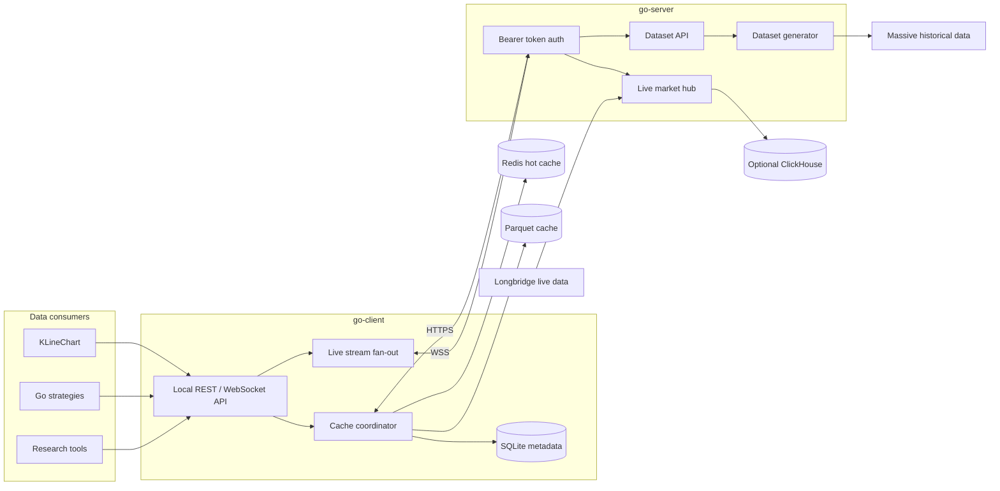
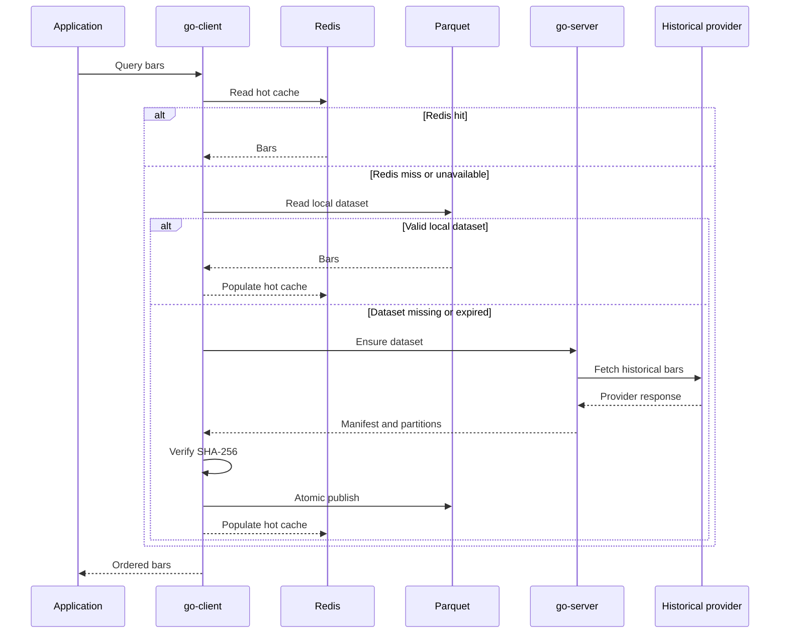
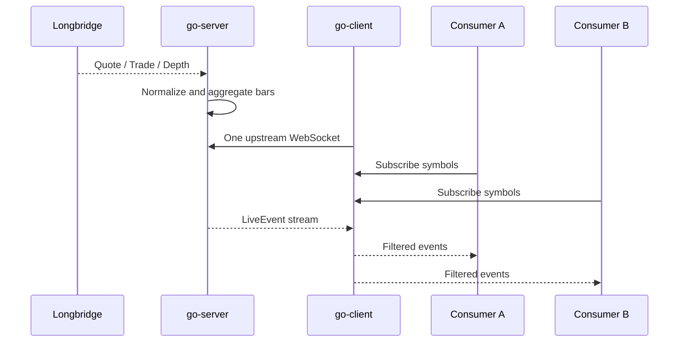

# market-bridge 架构设计

market-bridge 是一个面向行情分析、图表展示与策略回测的数据网关。它将远程行情接入与本地数据消费解耦，在统一数据模型之上提供历史数据集、实时行情流和可恢复的本地缓存。

本文描述当前架构、核心约束和后续演进方向。部署位置、云厂商和终端设备均不是架构的一部分；服务可以运行在任何满足网络与资源要求的环境中。

## 设计目标

- 通过统一接口屏蔽 Massive、Longbridge 等上游供应商的差异。
- 优先使用本地缓存，减少重复请求、网络延迟和供应商调用量。
- 让图表、研究工具和回测程序共享同一套数据语义。
- 将供应商凭据保留在服务端，不传递给本地应用或浏览器。
- 在 Redis 不可用或远程服务离线时，仍可读取已有 Parquet 数据。
- 使用不可变数据集、Manifest 和校验和保证缓存可复现、可验证。
- 将实时采集、历史数据和外部存储设计为可独立启用的能力。

## 系统概览



典型部署由一个靠近行情供应商的 `go-server` 和一个靠近数据消费者的 `go-client` 组成。两者也可以运行在同一台机器上。

应用默认通过 `go-client` 访问数据：

```text
KLineChart / strategy / research tool
                  │
                  ▼
              go-client
                  │
        Redis → Parquet → go-server
```

`go-server` 也暴露稳定的服务端 API，适合自建客户端、集成测试和运维诊断。供应商密钥只由 `go-server` 持有。

## 组件职责

### go-server

`go-server` 是远程行情接入层，负责：

- 通过 Massive 或 Mock Provider 生成历史行情数据集。
- 通过 Longbridge 或 Mock Provider 接收实时行情。
- 将供应商数据转换为统一的 Bar、Trade、Depth 和游标模型。
- 生成不可变的 Parquet 分区和 Manifest。
- 使用 Bearer Token 保护 `/v1/*` 接口。
- 可选地将实时事件写入外部 ClickHouse。
- 按 TTL 清理服务端临时数据集。

`go-server` 不运行用户策略，也不管理客户端缓存。

### go-client

`go-client` 是数据消费入口，负责：

- 为图表、策略和研究工具提供本地 REST/WebSocket API。
- 按 Redis、Parquet、go-server 的顺序读取历史数据。
- 下载并校验远程数据集，然后原子发布到本地缓存。
- 使用 SQLite 管理数据集索引、状态、访问时间和 TTL。
- 将远程实时连接复用并扇出给多个本地消费者。
- 托管内置 Web 页面，使浏览器与本地 API 保持同源。

`go-client` 默认监听本机地址，不应直接暴露到公网。

### Redis

Redis 是可选的热缓存：

- 保存解码后的热点数据，降低重复读取和反序列化开销。
- 默认 TTL 为 24 小时，使用 LRU 淘汰策略。
- Docker 部署默认使用 `maxmemory=1gb`，可通过 `REDIS_MAXMEMORY` 覆盖。
- 不启用持久化，不作为数据完整性的来源。
- 不可用时由 `go-client` 自动旁路到 Parquet。

### Parquet 与 SQLite

Parquet 是 `go-client` 的本地权威缓存，SQLite 保存缓存元数据：

- Parquet 默认按 `symbol/year` 分区。
- Manifest 记录数据规格、供应商、版本、行数、时间范围、文件大小和 SHA-256。
- SQLite 保存数据集状态、Manifest、最后访问时间和清理状态。
- 文件校验完成后通过原子 rename 发布，消费者不会读取半写文件。
- 默认按最后访问时间保留 30 天，可调整或关闭自动清理。

### ClickHouse

ClickHouse 是默认关闭的可选实时事件存储：

- 保存 Longbridge 推送的 Bar、Trade 和 Depth。
- 不参与 `go-client` 的本地缓存命中判断。
- 不作为 Massive 历史数据的全量镜像。
- 生命周期、容量和备份策略由外部 ClickHouse 部署负责。

## 历史数据流程



### 数据集标识

数据集由规范化请求和版本信息共同决定：

```text
dataset_id = SHA-256(
    normalized DatasetSpec
    + schema version
    + provider data version
)
```

因此，相同输入会得到相同 `dataset_id`，以下变化会生成新的数据集：

- 股票集合或时间范围变化。
- 周期、交易时段或调整模式变化。
- wire schema 版本变化。
- 上游数据版本变化。

数据集一旦发布即不可变。需要刷新时，由客户端显式请求新的数据版本或重新生成，而不是原地修改已有分区。

### 一致性约束

- Redis 或 Parquet 命中时，不访问远程服务检查版本。
- 本地完全缺失时必须返回完整请求范围，不静默返回部分数据。
- 同一数据集的并发 miss 合并为一个下载任务。
- 下载完成并通过 SHA-256 校验后才能发布。
- 多标的数据按 `(timestamp, symbol)` 排序，保证回测时间轴稳定。
- Redis 数据可以随时丢弃并从 Parquet 重建。

## 实时数据流程



实时链路遵循以下规则：

- `go-server` 为配置的 watchlist 建立一个 Longbridge 行情上下文。
- `go-client` 复用一条上游 WSS，并向本地消费者扇出。
- 慢消费者使用有界队列隔离，不阻塞上游采集。
- 队列溢出时返回显式 gap 事件，不静默丢失数据。
- `stream_epoch + event_type + symbol + sequence` 构成实时游标。
- 同一分钟的未完成 Bar 可以重复修订，`completed=true` 后视为最终值。

Longbridge 只负责实时行情。历史数据集由 `GO_SERVER_PROVIDER=massive|mock` 控制，实时数据由 `GO_SERVER_LIVE_PROVIDER=longbridge|mock` 控制。

## 统一数据模型

### DatasetSpec

```go
type DatasetSpec struct {
    Symbols    []string       `json:"symbols"`
    Interval   string         `json:"interval"`
    From       time.Time      `json:"from"`
    To         time.Time      `json:"to"`
    Session    Session        `json:"session"`
    Adjustment AdjustmentMode `json:"adjustment"`
}
```

规范化规则：

- 股票代码去除首尾空白、转为大写并去除可选 `.US` 后缀。
- 时间统一转换为 UTC。
- 默认周期为 `1m`。
- 默认交易时段为 `regular`。
- API 的 `auto` 按市场解析：美股为 `split_adjusted`，港股/A 股为 `forward_adjusted`，Binance 为 `raw`。浏览器页面会对美股显式请求 `forward_adjusted`，不暴露起止时间控件，并通过 KLineChart 的历史加载回调分块追溯至少两年。

### Bar

```go
type Bar struct {
    Symbol    string    `json:"symbol"`
    Timestamp time.Time `json:"timestamp"`
    Open      Decimal   `json:"open"`
    High      Decimal   `json:"high"`
    Low       Decimal   `json:"low"`
    Close     Decimal   `json:"close"`
    Volume    int64     `json:"volume"`
    Turnover  *Decimal  `json:"turnover,omitempty"`
    Session   Session   `json:"session"`
    Source    string    `json:"source"`
    Completed bool      `json:"completed"`
}
```

价格使用定点十进制表示，JSON 中编码为字符串，避免浮点误差。上游未提供的字段保持为空，不使用推测值补齐。

Massive 的 `adjusted=true` 只表示拆股调整。模型同时保留 `raw`、`split_adjusted` 和 `forward_adjusted`：美股前复权从拆股调整行情出发，将每次分红的历史调整因子从新到旧连乘，并只修改除息日前 OHLC；成交量沿用拆股调整数量，现金分红不修改 turnover。周、月、年线先逐日复权，再按纽约 ISO 周、自然月和自然年聚合。

ClickHouse 只保存 `split_adjusted` 的规范化一分钟美股母数据，美股 QFQ 在读取时动态生成。Schema 版本为 v2，QFQ 缓存语义版本为 v3；QFQ Redis、Parquet 和服务端 dataset 的身份按 `symbol=factor_version` 绑定，因此公司行动曲线变化或多标的因子交换后都不会复用旧结果。数据集入队时会固定同一批因子，生成内容与 manifest 版本一致。因子接口由 `history:read` 权限保护，go-client 将曲线缓存到下一个纽约自然日。旧缓存由新身份自动停止命中并按 TTL 清理，不要求清空 ClickHouse 数据。

### LiveEvent

```go
type LiveCursor struct {
    StreamEpoch string    `json:"stream_epoch"`
    EventType   EventType `json:"event_type"`
    Symbol      string    `json:"symbol"`
    Sequence    int64     `json:"sequence"`
}

type LiveEvent struct {
    Type      EventType       `json:"type"`
    Symbol    string          `json:"symbol"`
    Timestamp time.Time       `json:"timestamp"`
    Cursor    LiveCursor      `json:"cursor"`
    Bar       *Bar            `json:"bar,omitempty"`
    Trade     json.RawMessage `json:"trade,omitempty"`
    Depth     json.RawMessage `json:"depth,omitempty"`
    Reason    string          `json:"reason,omitempty"`
}
```

## HTTP 与 WebSocket 接口

### go-server

```http
GET  /healthz
POST /v1/datasets
GET  /v1/datasets/{dataset_id}
GET  /v1/datasets/{dataset_id}/manifest
GET  /v1/datasets/{dataset_id}/files/{partition}
GET  /v1/live/ws
GET  /v1/providers/massive/usage
```

除 `/healthz` 外，服务端接口使用 `Authorization: Bearer <token>` 鉴权。

`POST /v1/datasets` 可能返回 `202 Accepted`。客户端应轮询状态，待 `state=ready` 后读取 Manifest 和分区文件。服务端文件超过 TTL 后可能返回 `410 Gone`，客户端可以使用相同规格重新生成。

### go-client

```http
GET  /
GET  /healthz
GET  /readyz
POST /v1/datasets/ensure
GET  /v1/datasets/{dataset_id}
POST /v1/datasets/{dataset_id}/refresh
GET  /v1/bars/{symbol}
GET  /v1/cache
POST /v1/cache/prune
GET  /v1/live/ws
GET  /v1/providers/massive/usage
```

本地 REST、WebSocket 和 Go SDK 共享相同的请求及响应模型。

## 缓存生命周期

### Parquet TTL

- 默认 `720h`，从最后成功访问时间计算。
- `GO_CLIENT_PARQUET_TTL<=0` 时禁用自动清理。
- 清理器由 `GO_CLIENT_CLEANUP_INTERVAL` 控制，默认每 6 小时运行。
- 正在下载或读取的数据集不会被删除。
- 清理先更新 SQLite 状态，再删除文件和 Redis key，最后移除元数据。
- 启动时恢复未完成的 `downloading` 和 `deleting` 状态。

### Redis 降级

Redis 超时、断线或未启动时，`go-client` 立即旁路到 Parquet。Redis 恢复后，后续读取会自然回填热缓存，不需要人工重建。

## 安全边界

- Massive、Longbridge 和 ClickHouse 凭据只存在于 `go-server` 环境中。
- `go-client` 只保存访问 `go-server` 所需的 Token 和本机 Redis 配置。
- `.env` 文件权限应为 `0600`，不得写入镜像或提交到仓库。
- `go-server` 默认绑定宿主机 loopback，通过 Nginx/OpenResty 提供 TLS。
- `go-client` 默认只监听 loopback，浏览器页面不接触服务端 Token。
- 日志不得记录密钥、完整授权头或供应商响应中的敏感账户信息。
- 公网部署应限制请求体、并发任务、下载速率和可访问端口。

## 部署模型

生产部署提供两套独立配置：

```text
deploy/compose.server.yaml  # go-server
deploy/compose.client.yaml  # go-client + optional Redis
```

支持的运行方式：

- 使用公开镜像和 Docker Compose 部署。
- 从源码构建 Docker 镜像。
- 使用 Release 二进制运行原生客户端。
- 使用 systemd、systemd user service 或 macOS LaunchAgent 托管。

服务端默认发布到 `127.0.0.1:17601`，客户端默认监听 `127.0.0.1:17600`。跨主机连接应通过 HTTPS/WSS，证书和反向代理由部署环境负责。

## 可观测性与故障判定

- `/healthz` 只表示进程可以响应 HTTP，不代表供应商链路健康。
- `/readyz` 表示 `go-client` 是否满足对外服务条件。
- `go-server` 启动日志会记录已选择的历史和实时 Provider，但不会输出凭据。
- Massive usage API 记录由本服务发出的供应商请求，不代表整个 API Key 的全局用量。
- 实时事件中的 `source=mock-live` 表示模拟数据，`source=longbridge` 表示 Longbridge 数据。
- Longbridge 持续出现 `1006 unexpected EOF` 时，应检查重复连接、Token、IP 白名单、行情权限和区域路由。

完整部署验证和故障排查命令见 [go-server 部署、验证与故障排查](server-operations.md)。

## 当前能力与演进方向

### 已实现

- Mock 和 Massive 历史数据 Provider。
- Mock 和 Longbridge 实时数据 Provider。
- 不可变数据集、Parquet 分区、Manifest 和 SHA-256 校验。
- go-client SQLite/Parquet 缓存与可选 Redis 热缓存。
- go-client 本地 REST、WebSocket、Web UI 和 Go SDK。
- SQLite 团队账号、个人 API Key、角色 scope、用户配额、审计和 legacy admin Token 兼容。
- 有界数据集任务队列、服务端数据集 TTL 和客户端缓存 TTL。
- Longbridge 按活跃 WebSocket 连接动态订阅、用户级连接/标的配额和 Provider 状态。
- 可选 ClickHouse 实时事件写入。
- Docker、原生二进制及自动化发布流程。

### 演进方向

- 更完整的交易所日历、提前收盘和扩展时段处理。
- 断点续传、HTTP Range 和大数据集并行下载。
- 动态 watchlist 管理与平滑订阅切换。
- 实时游标持久化、缺口补发和恢复窗口。
- 多实例账号存储、分布式限流、对象存储和跨实例实时行情扇出。

路线图描述的是扩展方向，不构成现有 API 的兼容性承诺。公开接口的变更应遵循语义化版本和 Release Notes。

## 验收原则

- Redis 命中时不读取 Parquet，也不请求 `go-server`。
- Redis miss、Parquet 命中时不请求 `go-server`，并回填 Redis。
- Redis 不可用时，已有 Parquet 数据仍可离线读取。
- 本地完全缺失时，同一数据集只触发一次下载任务。
- 消费者不会读取未校验或未完整发布的文件。
- 修改数据规格或数据版本会得到新的数据集 ID。
- 图表、REST 和 Go SDK 对相同请求返回一致的数据语义。
- 多个实时消费者共享上游连接，慢消费者不会阻塞采集。
- Mock 与真实 Provider 在输出中可明确区分。
- 凭据不出现在镜像、仓库、浏览器或普通日志中。
